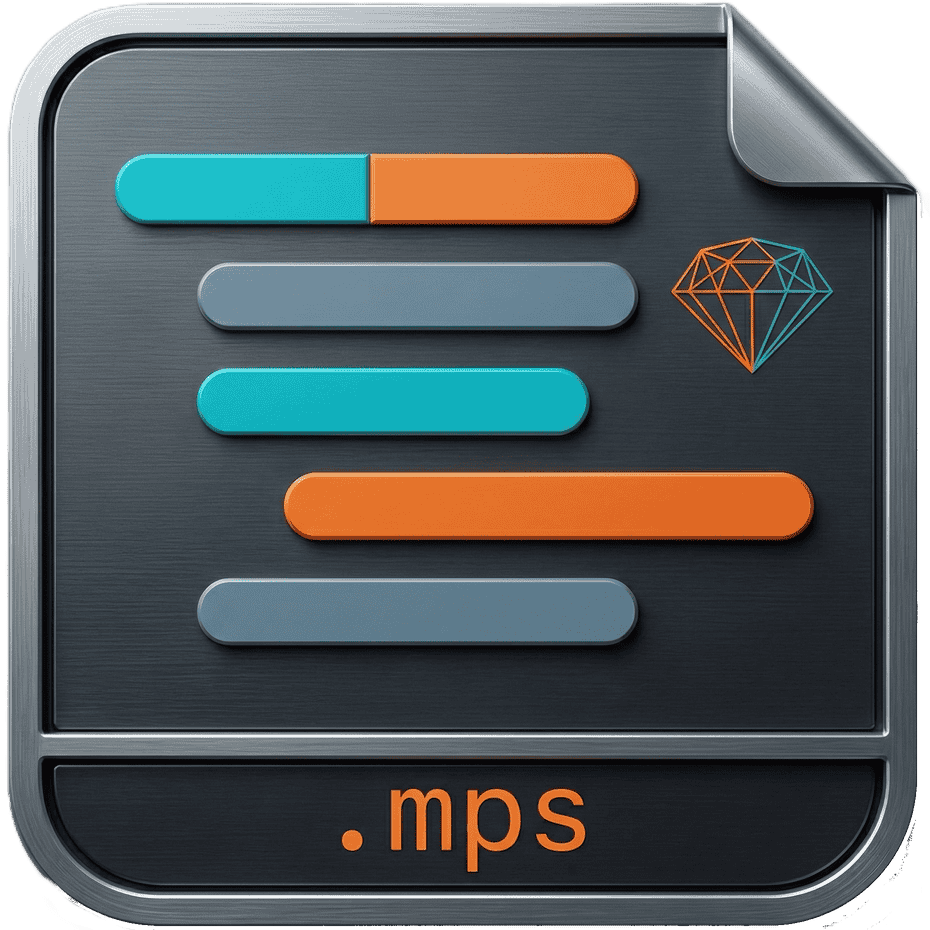

  

  
  
  

## Technical Documentation

Explore the high-fidelity design and programmable capabilities of Macropad:
- **[Architecture Overview](docs/ARCHITECTURE.md)**: Process isolation, OS-level hooks, and IPC protocol design.
- **[Scripting Guide](docs/SCRIPTING.md)**: Deep dive into the `.mps` language, variables, and execution rules.

---

# Macropad

Macropad is a desktop automation tool built around one constraint: the recording and playback must be exact. Not "close enough." Not "works most of the time." Exact.

To get there, the architecture splits into two independent processes: a background daemon written in Rust that owns all event capture and playback, and a React/Tauri interface that handles configuration and state. The daemon runs whether the GUI is open or not. The GUI never touches a timing-critical path. This separation is the reason Macropad can make guarantees that general-purpose automation tools cannot.

---

## How the Execution Engine Works

Most automation tools operate at the application layer. They simulate input by asking the OS to inject events, but they start from above the point where hardware signals actually land. Macropad starts lower.

**OS-Level Hardware Interception**

The daemon hooks directly into the OS input stack at its lowest user-space layer. On Windows this uses `SetWindowsHookEx` with `WH_KEYBOARD_LL` and `WH_MOUSE_LL`. On macOS it goes through Quartz Event Services via `CGEventTapCreate`. On Linux it reads from the `evdev` interface. These are the same hooks the OS itself uses to route input before any application sees it.

The practical result: events cannot be "missed" by a polling cycle, and playback is indistinguishable from physical input. Privileged and isolated environments that reject simulated input at the application layer still accept it here.

**Visual Node Editor**
Recordings are stored as structured event trees, not flat keystroke logs. The React GUI lets you edit that tree directly: change how long a key is held in milliseconds, adjust a mouse path's bezier curve, add conditional delays, insert logic branches. None of this requires touching the underlying file format by hand.

**Centralized Asset Library**
Manage hundreds of macros through a clean, searchable interface. Tag automations by project, sort by execution frequency, and instantly sync changes back to the daemon without restarting the engine.

**Intelligent Display Scaling**
Record a macro on a 4K desktop, play it back on a 1080p laptop. Macropad embeds the native display resolution into the recording and dynamically scales absolute mouse coordinates at runtime to guarantee the cursor hits the exact same relative targets.

**Dynamic Macro Scripting**
When static recording isn't enough, switch to Macropad Script (`.mps`). Evaluate screen pixels in real-time, generate randomized keystroke delays to simulate human typing cadence, and programmatically loop through smaller "component macros" to build massive, conditional workflows.

**Global Hotkey Routing**

The daemon maintains a dedicated listening thread for hotkey chords. When a chord fires, for example `Ctrl+Shift+Alt+F12`, playback starts immediately regardless of which application has focus, what the system load is, or whether the GUI is running at all. The listening thread does not share a queue with the execution engine.

**Input Consolidation**

Raw OS recording generates thousands of micro-movement events per second. The recording engine merges adjacent, functionally identical path segments into optimized vectors in real time. The resulting files are significantly smaller, and playback is smoother than a naive frame-by-frame replay because micro-jitter is removed at the source.

**Playback Overrides**

Speed, loop count, and coordinate offsets can be set globally at runtime, applied uniformly across all nodes in a recording without editing the file itself.

---

## Architecture

**The Rust Daemon (`macropad-daemon`)**

This is the actual engine. It runs as a standalone binary in the background and handles everything timing-sensitive.

It uses `tokio` for its async runtime, running global hotkey listening, IPC message polling, and macro execution state machines as concurrent tasks on separate threads. Nothing blocks.

IPC with the frontend uses native OS channels exclusively: Named Pipes on Windows, Unix Domain Sockets on macOS and Linux. This avoids the network stack entirely and keeps latency at the OS level.

**The React Interface (`macropad-gui`)**

The GUI is a visual representation of the daemon's state, not a controller of it. It renders using the host's native webview (WebView2 on Windows, WebKit on macOS/Linux) so UI work stays off the threads the daemon needs for event capture.

From the GUI you can manage your `.mpr` recording library, edit macro event trees, and issue commands (Record, Stop, Play, Abort) that serialize over the local IPC socket to the daemon.

---

## File Formats

Both formats are plaintext, human-readable, and work cleanly with version control.

###  The MPR Format (`.mpr`)

An `.mpr` file is a validated JSON document representing a chronological sequence of hardware events. It has three sections:

- **Header:** Semantic version for backwards compatibility, ISO 8601 timestamps, author fields, and user-defined tags for organizing large libraries.
- **Config:** The display resolution at recording time, loop thresholds, and playback speed multiplier. If you run an `.mpr` on a different display resolution, the daemon detects the mismatch and scales absolute mouse coordinates via ratio matrices automatically.
- **Event Tree:** The actual sequence of nodes:
  - `DelayNode`: A deliberate pause in milliseconds.
  - `MouseNode`: Absolute X,Y coordinates, button state (`LeftDown`, `RightUp`, `Extra1`), and scroll wheel delta.
  - `KeyNode`: Virtual Key Code or Scancode, with explicit state (`Press`, `Hold`, `Release`) for accurate chord and modifier recreation.

###  The MPS Format (`.mps`)

`.mps` is where Macropad stops being a recorder and becomes a programmable automation engine. An `.mps` file is a script interpreted directly by the Rust daemon's execution engine. It is Turing-complete.

What this unlocks in practice:

- **Control flow:** Standard `for`/`while` loops, `if/else` branching on environment variables, polling loops that wait for a specific pixel color to appear before continuing.
- **Dynamic input:** Variables, arithmetic, and runtime-generated input arguments. You can randomize delay intervals between keystrokes to produce human-level timing variance, or calculate mouse targets relative to the active window's current dimensions rather than against fixed coordinates.
- **Composition:** An `.mps` script can invoke `.mpr` recordings as components. Build a library of small, reusable macros ("Login.mpr", "SubmitForm.mpr") and orchestrate them with logic in a parent script.
- **Sequential Execution:** By default, the `run` command blocks script execution until the daemon finishes playing the target macro. This ensures predictable timing in loops and prevents "daemon is busy" synchronization errors.
- **Platform-native Lexing:** The script lexer is optimized for Windows environments, supporting raw string paths (`r"C:\..."`) and standard file system conventions for robust cross-directory automation.
- **Direct execution:** When the daemon receives an `.mps` execution command via hotkey, it compiles the script to an AST in memory and runs it. The GUI is not involved. This is the fastest execution path.

---

## Platform Support

Macropad compiles to native machine code for each target. There is no JVM, no Python runtime, no wrapper layer.

The CI pipeline produces native installers for:

- **Windows 10/11:** `.msi` and `.exe`
- **macOS:** Universal `.dmg` supporting both Apple Silicon (M-series) and Intel
- **Linux:** AppImage and `.deb`, with support for both Wayland and X11

The daemon binary ships inside the Tauri installation directory and communicates over OS-native IPC sockets. The behavior is identical across platforms.

---

## Testing & Quality Assurance

Macropad maintains a high standard of reliability through a multi-layered testing architecture and automated verification.

**Centralized Integration Suite**

A dedicated `tests/` package at the workspace root manages complex end-to-end scenarios. These tests bypass the GUI to interact directly with the Rust daemon and IPC layer, simulating real-world automation workflows.

**Core & Scripting Validation**

- **Logic Flow**: Automated tests verify that the scripting engine correctly handles variable scoping, conditional branching, and loop iterations.
- **Data Integrity**: Every hardware event (keyboard, mouse, delay) is validated for serialization correctness across the IPC boundary.
- **Path Handling**: Dedicated lexer tests ensure that Windows-style paths and raw strings are parsed accurately without escaping side effects.

**Continuous Integration**

Every commit and pull request triggers an automated GitHub Actions pipeline on Windows. The CI environment enforces a strict quality gate:
- **Workspace Tests**: Executes the full suite of unit and integration tests.
- **Static Analysis**: Runs Clippy for deep code quality inspections and performance optimization suggestions.
- **Format Enforcement**: Validates that all code adheres to the project's formatting standards via `rustfmt`.

---

## License

Macropad is open source under the Apache License 2.0. See the `LICENSE` file in the repository for full terms.